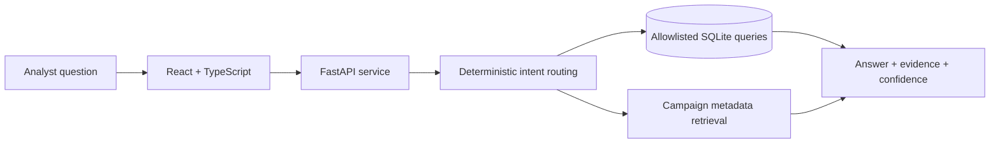

# SmartAdQuery

Ask advertising-performance questions in plain English and get a grounded answer, the supporting rows, and an explicit confidence level.

SmartAdQuery is a full-stack campaign analytics application for marketers and analysts who need to identify strong channels, surface underperforming campaigns, and inspect portfolio performance without writing SQL. A React interface sends each question to a FastAPI service, which routes it to reviewed SQLite query templates or deterministic campaign-metadata retrieval.

> This is a public reconstruction built with synthetic campaign data. It contains no employer or customer code, data, prompts, or infrastructure.

## What you can ask

- **“Compare performance by channel”** — ranks channels by return on ad spend (ROAS).
- **“Show the top campaigns”** — returns the five campaigns with the highest ROAS.
- **“Show underperforming campaigns”** — finds campaigns below a defined ROAS threshold.
- **Campaign, channel, or region questions** — retrieves matching campaign records from local metadata.
- **Portfolio questions** — summarizes spend, revenue, impressions, clicks, conversions, and ROAS.

Every response includes the detected intent, source rows, a citation to the synthetic dataset, confidence, and known limitations. The result is inspectable instead of being an unsupported generated answer.

## How it works



1. The analyst submits a natural-language question.
2. The service maps recognized analytics intents to parameterized, reviewed SQL templates.
3. Metadata-specific questions use local token-vector similarity across campaign names, channels, and regions.
4. The API returns a concise answer together with the records used to produce it.

The application never turns prompt text into executable SQL. This keeps the analytics boundary predictable and prevents arbitrary database queries.

## Engineering highlights

- React and TypeScript analyst interface with reusable example questions
- FastAPI endpoints for health checks, campaign records, and analytics queries
- Read-only, in-memory SQLite analytics over a documented synthetic dataset
- Allowlisted and parameterized SQL instead of unrestricted model-generated queries
- Deterministic local retrieval with no hosted model or API key required
- Row-level citations, confidence labels, and limitation fields
- API and service tests for grounding, ranking, and safe-query behavior
- Docker Compose setup for running the frontend and backend together

## Run locally

### Docker

```bash
docker compose up --build
```

Open `http://localhost:5173`. FastAPI documentation is available at `http://localhost:8000/docs`.

### Without Docker

Start the API:

```bash
cd backend
python -m venv .venv
.venv/Scripts/pip install -r requirements.txt
set PYTHONPATH=.
.venv/Scripts/uvicorn app.main:app --reload
```

Start the frontend in a second terminal:

```bash
cd frontend
npm install
npm run dev
```

## API example

```bash
curl -X POST http://localhost:8000/query \
  -H "Content-Type: application/json" \
  -d '{"question":"Compare performance by channel"}'
```

The response contains `answer`, `intent`, `rows`, `citations`, `confidence`, and `limitations` fields.

## Test

```bash
cd backend
set PYTHONPATH=.
pytest
```

## Design choices

- **Safe, reproducible data:** the included synthetic dataset makes every example runnable without exposing proprietary campaign data.
- **Predictable analytics:** bounded intent routing and reviewed SQL templates keep answers testable and prevent prompt text from becoming executable SQL.
- **Local-first retrieval:** campaign metadata search runs without external model APIs, credentials, or usage costs.
- **Inspectable results:** answers expose their supporting records, source citation, confidence, and limitations so analysts can verify the output.
