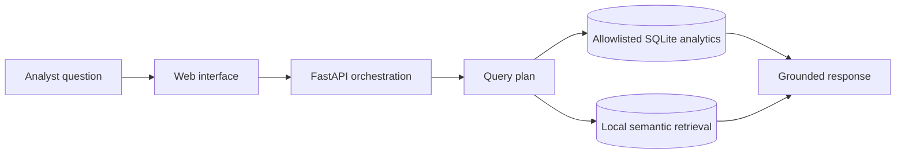

# SmartAdQuery

SmartAdQuery is a full-stack semantic analytics application for exploring advertising performance with natural-language questions. It combines a React and TypeScript interface, a FastAPI backend, constrained SQLite analytics, and local semantic retrieval over a synthetic campaign dataset.

This repository is a public reconstruction built with synthetic data. It does not contain employer or customer code, data, prompts, or infrastructure.

## What is implemented

- React and TypeScript analyst interface with example questions and responsive results
- FastAPI endpoints for campaign records, health checks, and grounded analytics queries
- allowlisted SQL templates rather than unrestricted model-generated SQL
- deterministic semantic retrieval over campaign names, channels, and regions
- row-level citations and explicit confidence and limitation fields
- synthetic data with a documented schema
- service-level tests and local Docker Compose setup

## Intended request path



## Run locally

```bash
docker compose up --build
```

Then open `http://localhost:5173`. The API documentation is available at `http://localhost:8000/docs`.

Without Docker:

```bash
cd backend
python -m venv .venv
.venv/Scripts/pip install -r requirements.txt
set PYTHONPATH=.
.venv/Scripts/uvicorn app.main:app --reload
```

In a second terminal:

```bash
cd frontend
npm install
npm run dev
```

## API example

```bash
curl -X POST http://localhost:8000/query \
  -H "Content-Type: application/json" \
  -d '{"question":"Compare performance by channel"}'
```

## Test

```bash
cd backend
set PYTHONPATH=.
pytest
```

## Safety model

SmartAdQuery does not execute arbitrary SQL. The service maps supported intents to reviewed query templates and parameterized values. This prevents prompt text from becoming executable database instructions.

## Limitations

- The dataset is synthetic and intentionally small.
- Retrieval uses local token-vector similarity rather than a hosted embedding model.
- The current application supports a bounded set of analytics intents.
- Reported resume metrics from prior private work are not reproduced or claimed by this public reconstruction.
- Production deployments would require authentication, persistent storage, request tracing, rate limiting, and a formal evaluation dataset.
